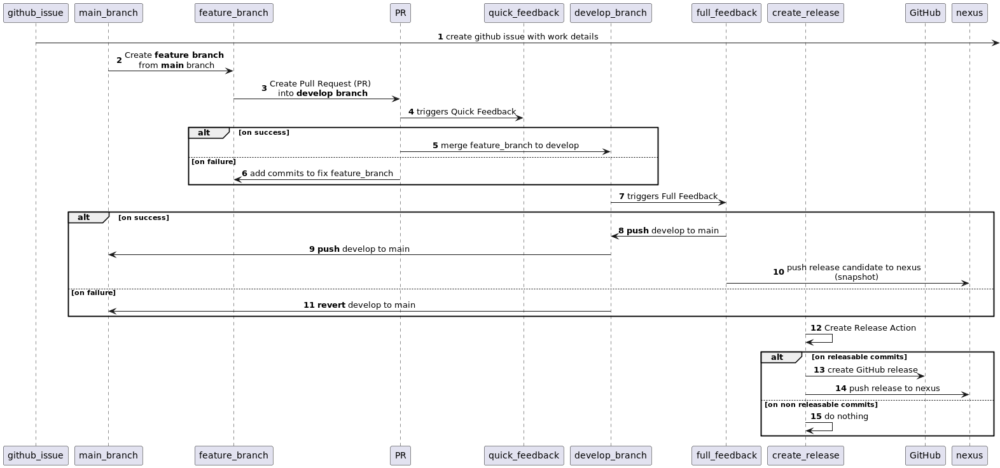

# Table of contents

* [Intro](#intro)
* [Delivery pipeline](#delivery-pipeline)
  * [Principles](#principles)
  * [Strategies](#strategies)
    * [Branching](#branching)
      * [main branch](#main-branch)
      * [develop branch](#develop-branch)
      * [feature brancehes](#feature-branches)
      * [bugfix branch](#bugfix-branch)
    * [Versioning](#versioning)
    * [Commit message](#commit-message)
      * [why?](#why)
      * [what?](#what)
      * [how?](#how)
      * [when?](#when)

# Intro
This is a proposed end to end software delivery pipeline aimed at meeting two goals:  
1. Business goal of delivering faster, better and cheaper;
2. Increasing developer satisfaction and productivity while reducing their stress.

# Delivery pipeline
## Principles

## Workflow
The end to end delivery pipeline workflow looks like this: 
  * 
1. Crete a GitHub issue with details of the changes that need to be implemented;
2. Create a feature branch from main branch;

# Strategies
## Branching
We need a branching strategy which will ensure speed and quality of our deliveries.
In order to achieve this there are several criteria for choosing the right branching strategy:
1. Developers need to be able to work in parallel without affecting each other;
2. There should be a quick feedback (max 10 minutes) to the developers on changes, waiting long time for feedback is counterproductive;
3. There should be a full feedback before releasing a new version;
4. No common branch freezing;
5. No one developer blocking others and having to fix problems under pressure;
6. Main branch should always be green, so at any time anyone can branch out with confidence that there are no problems;
7. Ensure linear, clean history with meaningful commits;

[table of contents](#table-of-contents)

To meet the above criteria, we have chosen a modified version of the GitFlow branching strategy:
### main branch
1. long-lived stable branch containing the latest fully tested code;
2. commits into this branch are the last step in the delivery pipeline after the code was fully tested on all levels;
3. so this branch is always in a green state;

[table of contents](#table-of-contents)

### develop branch
1. longed-lived unstable branch used for triggering the Full feedback pipeline;
2. often this branch contains not fully tested code which can be reverted anytime to main (in case of pipeline failures);

[table of contents](#table-of-contents)

#### feature branches
1. short term branch to develop one feature;
2. it should be branched of the main branch;
3. it should be named after Jira ticket, example: PIC-303
   PIE-303 - Propose an improved delivery pipeline DEV IN PROGRESS , reason for this is
   that the pipeline will be able to link the branch to the Jira ticket, so that the change description can be linked with the implementation code;
4. after the feature is completed and Quick feedback pipeline is green a PR merged into develop it will be deleted;

[table of contents](#table-of-contents)

### bugfix branch
1. short lived branch for production version fixes;
2. it should be created of the current production release version tag;
3. each commit to this branch will trigger Bugfix pipeline and upon success will result in a new bug fix release version (see Versioning for details);
4. this branch will NOT be merged into any branch nor it will be deleted automatically;
5. changes from this branch will need to be manually applied (cherry picked or manually copied) to the develop branch, which will trigger develop Full
   feedback pipeline and upon success end up in main this way;
6. after applying the changes to develop, success "Full Feedback" pipeline and merge into main, this branch needs to be manually deleted;

[table of contents](#table-of-contents)

From the gitflow we left out:
1. release branches and hotfix branches as they are replaced by the release tags;
2. merging to main from release and hotfix branches, as The only way into main branch is from develop branch.

## Versioning
* How strange it may seem, this is one of the topics that generate fierce debates, each time there is a new release people try to come up with a version, many times based on feelings.
* Then they get so attached emotionally that it becomes very sentimental like many examples from the [Sentimental Versioning](http://sentimentalversioning.org/) web site.
* We would like to take a more mathematical approach proposed by [Semantic Versioning](https://semver.org/);

Given a version number MAJOR.MINOR.PATCH (example: 1.2.3) increment the:
1. MAJOR version adds backward incompatible API changes, it will change version 1.2.3 to 2.0.0;
2. MINOR version adds functionality in a backwards compatible manner, it will change version 1.2.3 to 1.3.0
3. PATCH version adds backwards compatible bug fixes, it would change the version 1.2.3 to 1.2.4

Base on these versions we can draw automatically some statistics that can inform our DORA metrics.

[table of contents](#table-of-contents)

## Commit Message
### Why?
   We need such a commit message format so it can be automatically parsed by the pipeline to:
1. figure out if there needs to be a new release or not (in case there is no new deployable code, like typo fixes, tests added, etc.);
2. if there needs to be a new release, to derive the next semantic versioning;
3. to be able to generate release changelog like this;
4. to be able to generate releases like these;
   On top of the above, we would like a commit message log which has meaningful commits with well formatted messages.
   table of contents
### What?
   In a nutshell there will be one github squashed commit per pull request, which will have the message of the Pull Request Title containing one of 4 key
   words:
1. fix - meaning commit contains a bug fix and it will generate a new semantic version with the patch version changed;
2. feat- meaning commit contains a new feature and it will generate a new semantic version with the minor version changed;
3. breaking change - meaning commit contains a backward incompatible api changes and it will generate a new semantic version with the major
   version changed;
4. anything else - meaning there is no new release generated;
   For more details and examples please read on.
   table of contents
### How?
Our commit messages will follow Conventional Commits with Angular Commit Message Conventions rules adding Jira ticket id and pull request number.
Commit messages will be parsed and validated using Semantic Release libraries to generate Semantic Version, change changelog like this and releases
like these.

NOTE: if the commit message won't follow this format, develop branch will be reset to master and you will need to raise a Pull Request again with the
correct format of the commit message/s.

Commit message should be in the following format:

type([optional scope]): description [Issue number]

[optional body]

[optional footer(s)]

Example:
* For Pull Request Title (when using option Squash and merge on github):
  * feat: add incidents endpoint (PIE-323) #65
* For feature branch commits (when using option Rebase and merge on github) :
  * feat: add incidents endpoint (PIE-323)

For why and how to write a good commit message see https://chris.beams.io/posts/git-commit/

Writing good commits rules can be summarized in the steps:
1. Separate subject from body with a blank line
2. Limit the subject line to 50 characters
3. Capitalize the subject line
4. Do not end the subject line with a period
5. Use the imperative mood in the subject line
6. Wrap the body at 72 characters
7. Use the body to explain what and why vs. how

[table of contents](#table-of-contents)

### When?
* The advised option for merging a Pull Request from feature branch into develop is Squash and merge.
* The new commit message which squashes the feature branch commits into one is taken from the Pull Request Title.
* All squashed commit messages and references will be part of the Pull Request message body, so it will be like a book:
  * Pull request title will be the book's name;
  * Pull request message body will be the table of contents
 
## Semantic release
