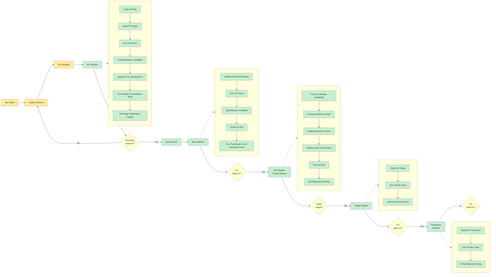
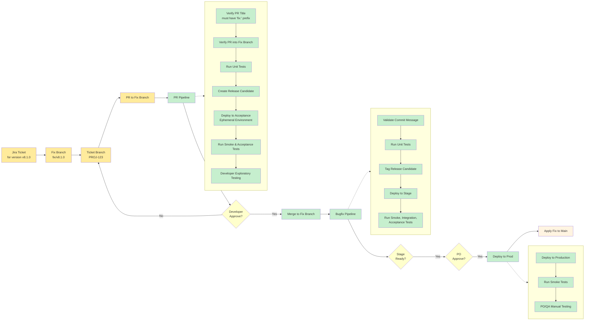
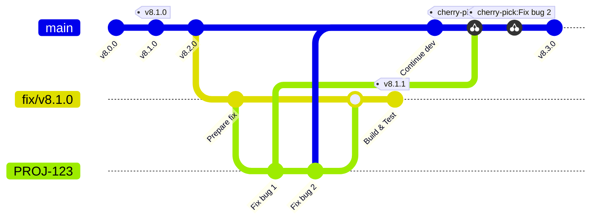
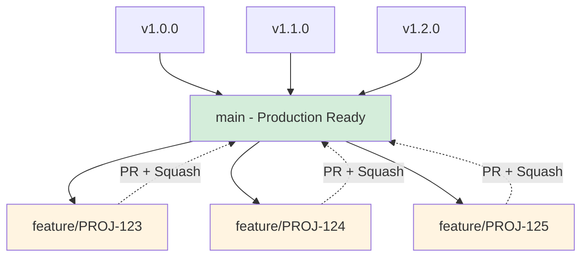
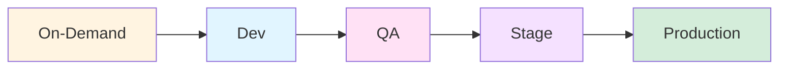

# One Long Lived Branch Implementation

## Table of Contents

- [Overview](#overview)
- [Main Flow](#main-flow)
  - [End-to-End Delivery Pipeline Diagram](#end-to-end-delivery-pipeline-diagram)
  - [Workflow Steps](#workflow-steps)
- [Bugfix Flow](#bugfix-flow)
  - [Bugfix Workflow Diagram](#bugfix-workflow-diagram)
  - [Bugfix Steps](#bugfix-steps)
  - [Bugfix Branch Strategy](#bugfix-branch-strategy)
  - [Key Differences from Main Flow](#key-differences-from-main-flow)
- [Requirements Reference](#requirements-reference)
  - [Pull Request Title Requirements](#pull-request-title-requirements)
  - [Branch Naming Convention](#branch-naming-convention)
  - [Semantic Versioning](#semantic-versioning)
  - [Squash on GitHub](#squash-on-github)
- [Benefits](#benefits)
- [Branch Strategy Summary](#branch-strategy-summary)
- [Environments Flow](#environments-flow)

## Overview

This implementation uses a single long-lived branch (`main`) with feature branches for development work. This is a trunk-based development approach that emphasizes continuous integration and rapid feedback.

**Related Theory:**
- [Branching Strategies](../theory.md#branching)
- [Continuous Integration](../theory.md#continuous-integration-ci)
- [Principles](../theory.md#principles)

## Main Flow

The end-to-end delivery pipeline of the main flow would look like the diagram below:

### End-to-End Delivery Pipeline Diagram



### Workflow Steps

#### 1. Create a Jira Ticket

Create a Jira ticket describing the required change.

#### 2. Create Feature Branch

Create a feature branch off `main` with the name of the Jira ticket.

**Example:** `PROJ-123` - "Propose an improved delivery pipeline"

**Important Notes:**

- This is needed for the pipeline to automatically link the branch to the Jira ticket
- If the branch name is not in the format of `PROJ-123` or `apply/v8.1.2`, it will fail branch validation

#### 3. Development on Feature Branch

Before pushing commits to origin, make sure:

- [ ] All the tests pass on your machine

#### 4. Create Pull Request

Once feature is completed, create a PR to merge `feature branch` into `main` branch, which will trigger **PR Pipeline** that will:

**Related Theory:** 
- [Testing - Unit Tests](../theory.md#unit)
- [Testing - Smoke Tests](../theory.md#smoke)
- [Testing - Acceptance Tests](../theory.md#acceptance)

**PR Pipeline Actions:**

1. Verify PR title follows [Pull Request Title](#pull-request-title-requirements) requirements
   - If it doesn't, the pipeline will fail

2. Verify PR is created from feature branch into main branch
   - If not, the pipeline will fail with an error saying PR must be raised into main branch

3. Run unit tests

4. Create a release candidate

5. Deploy release candidate to on-demand environment (branch/acceptance or personal environment)

6. Run smoke & acceptance tests

7. Developer can run exploratory testing and any early demo before getting PR approved

#### 5. Merge to Main

Once the **PR Pipeline** is green and PR reviewed and approved:

- [ ] Merge the changes using "Squash and Merge" option (see [Squash on GitHub](#squash-on-github))

**Related Theory:** [Commit Message](../theory.md#commit-message)

#### 6. Main Pipeline

Once feature branch is merged into `main`, the **Main Pipeline** will be triggered, which will:

**Related Theory:**
- [Release Candidate](../theory.md#release-candidate)
- [Deployment](../theory.md#deployment)
- [Environments](../theory.md#environments)

**Main Pipeline Actions:**

1. Validate commit message follows standards
   - If not, the pipeline will fail

2. Run unit tests

3. Tag release candidate with main head commit hash

4. Deploy artifact to dev environment

5. Run long running functional and non-functional tests

6. Trigger QA Pipeline which will wait for QA to approve it

#### 7. QA Pipeline

Once the QA and PO is happy with delivered functionality, approve **QA Pipeline**, which will:

**Related Theory:**
- [Release](../theory.md#release)
- [Versioning](../theory.md#versioning)
- [Testing - Exploratory](../theory.md#exploratory)

**QA Pipeline Actions:**

1. Promote release candidate to release
   - Creating release notes
   - Assigning next [Semantic Versioning](#semantic-versioning) tag

2. Deploy new release to QA environment

3. Run all tests

4. QA can run exploratory tests

**Next Steps:**

- If the tests are successful: QA or PO can trigger Stage Pipeline
- If the tests are unsuccessful: QA should raise a bug fix Jira ticket and developers fix it using Bugfix pipeline

#### 8. Stage Pipeline

Once **Stage Pipeline** is triggered:

**Stage Pipeline Actions:**

1. Wait for PO to approve deployment

2. Deploy newly created release to stage environment

3. Run smoke tests

4. QA and PO can run exploratory manual tests

**Next Steps:**

- If the tests are successful: QA or PO can trigger Production Pipeline
- If the tests are unsuccessful: QA should raise a bug fix Jira ticket and developers fix it using Bugfix pipeline

#### 9. Production Pipeline

Once **Production Pipeline** is triggered:

**Production Pipeline Actions:**

1. Wait for PO to approve prod deployment

2. Deploy to production

3. Run smoke tests

4. PO/QA can run manual exploratory testing

#### 10. DORA Metrics Collection

Based on the [Semantic Versioning](#semantic-versioning) and durations, the DORA metrics will be collected to help us measure, assess and improve our delivery process.

**Related Theory:**
- [Measure - DORA Metrics](../theory.md#measure)
- [Assess](../theory.md#assess)
- [Improve](../theory.md#improve)

## Bugfix Flow

A step-by-step guide for implementing, releasing, and deploying a bug fix.

**Related Theory:**
- [Versioning - Semantic Versioning](../theory.md#versioning)
- [Branching Strategies](../theory.md#branching)

### Bugfix Workflow Diagram



### Bugfix Steps

#### 1. Create Jira Ticket

Create a Jira ticket mentioning which version needs to be fixed (for example `v8.1.0`) and describing the bug.

#### 2. Create Fix Branch

Create a fix branch with the version to be fixed.

**Example:** `fix/v8.1.0`

#### 3. Create Ticket Branch

Create a ticket branch off the fix branch with the name of the Jira ticket.

**Example:** `PROJ-123` - "Fix critical bug in version 8.1.0"

**Important Notes:**

- This is needed for the pipeline to automatically link the branch to the Jira ticket
- If the branch name is not in the format of `PROJ-123`, it will fail branch validation

#### 4. Development on Ticket Branch

Before pushing commits to origin, make sure:

- [ ] All the tests pass on your machine

#### 5. Create Pull Request to Fix Branch

Once the fix is completed, create a PR to merge Jira ticket branch (`PROJ-123`) into fix branch (`fix/v8.1.0`), which will trigger **PR Pipeline** that will:

**PR Pipeline Actions:**

1. Verify PR title follows [Pull Request Title Requirements](#pull-request-title-requirements) and only has `fix:` prefix
   - If it doesn't, the pipeline will fail

2. Verify PR is created from Jira ticket branch into fix branch
   - If not, the pipeline will fail with an error saying PR must be raised into fix branch

3. Run unit tests

4. Create a release candidate

5. Deploy release candidate to acceptance ephemeral environment

6. Run smoke & acceptance tests

7. Developer can run exploratory testing and any early demo before getting PR approved

#### 6. Merge to Fix Branch

Once the **PR Pipeline** is green and PR reviewed and approved:

- [ ] Merge the changes using "Squash and Merge" option (see [Squash on GitHub](#squash-on-github))
- [ ] Acceptance environment will be automatically destroyed

#### 7. Bugfix Pipeline

Once the ticket branch is merged into fix branch, the **Bugfix Pipeline** will be triggered, which will:

**Bugfix Pipeline Actions:**

1. Validate commit message follows standards
   - If not, the pipeline will fail

2. Run unit tests

3. Tag release candidate with fix branch head commit hash

4. Deploy artifact to stage environment (waiting for approval)

5. Run smoke, integration, acceptance and any other functional or non-functional tests

6. Trigger deploy to prod environment

#### 8. Deploy to Production

Trigger release deployment to production:

**Production Deployment Actions:**

1. Wait for PO to approve prod deployment

2. Deploy to production

3. Run smoke tests

4. PO/QA can run manual exploratory testing

#### 9. Apply Fix to Main Branch

Apply the fix changes on top of main branch so they are not lost next time we do a main pipeline release.

**Important:** This ensures the bugfix is incorporated into the main branch and won't be lost in future releases.

#### 10. DORA Metrics Collection

Based on the [Semantic Versioning](#semantic-versioning) and durations, the DORA metrics will be collected to help us measure, assess and improve our delivery process.

### Bugfix Branch Strategy



### Key Differences from Main Flow

1. **Fix branch created from specific version tag** - Not from main
2. **PR merges into fix branch** - Not into main
3. **Ephemeral acceptance environment** - Automatically destroyed after merge
4. **Direct to stage deployment** - Skips dev environment
5. **Manual application to main** - Fix must be cherry-picked or applied to main branch
6. **Patch version increment** - Results in version like `v8.1.1` (PATCH increment)

## Requirements Reference

**Related Theory:**
- [Commit Message](../theory.md#commit-message)
- [Versioning](../theory.md#versioning)

### Pull Request Title Requirements

- Follow Conventional Commits specification
- Must include Jira ticket ID in format: `PROJ-123`
- Clear description of changes

**Example:**
```
feat: add incidents endpoint [PROJ-123]
```

### Branch Naming Convention

Feature branches must follow one of these formats:

- `PROJ-123` (Jira ticket ID)
- `apply/v8.1.2` (Version application)

Branches not following these formats will fail validation.

### Semantic Versioning

Version format: `MAJOR.MINOR.PATCH`

- **MAJOR:** Incompatible API changes
- **MINOR:** Backwards-compatible functionality additions
- **PATCH:** Backwards-compatible bug fixes

### Squash on GitHub

**Squash and Merge:**
- Combines all commits from feature branch into a single commit
- Keeps main history clean and linear
- Recommended for all feature branches in this strategy

## Benefits

**Related Theory:**
- [Goal - Elite Pipeline](../theory.md#goal---more-cheaper-faster)
- [Principles](../theory.md#principles)
- [Objectives - Automate](../theory.md#automate)

- **Single source of truth:** Only `main` branch is long-lived
- **Simplified workflow:** No integration branch complexity
- **Fast feedback:** Quick PR pipeline for developers
- **Quality gates:** Multiple approval points (Developer, QA, PO)
- **Flexible deployment:** On-demand deployments to different environments
- **DORA metrics collection:** Continuous improvement tracking
- **Exploratory testing opportunities:** At multiple stages (PR, QA, Stage, Production)

## Branch Strategy Summary

**Related Theory:** [Branching Strategies](../theory.md#branching)



## Environments Flow

**Related Theory:** [Environments](../theory.md#environments)



---

*Implementation: One Long Lived Branch (main only)*
