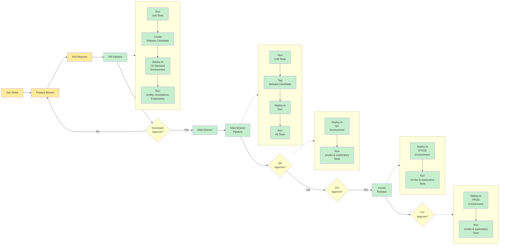
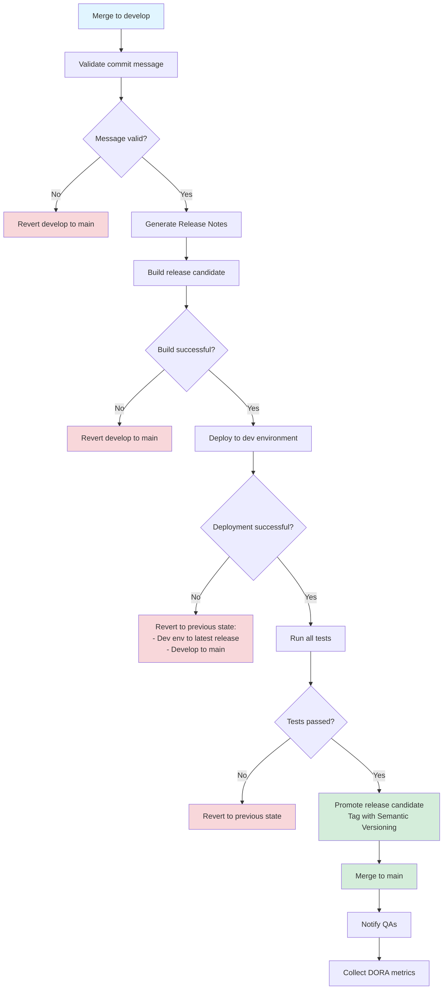
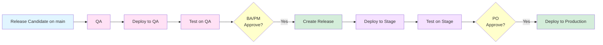
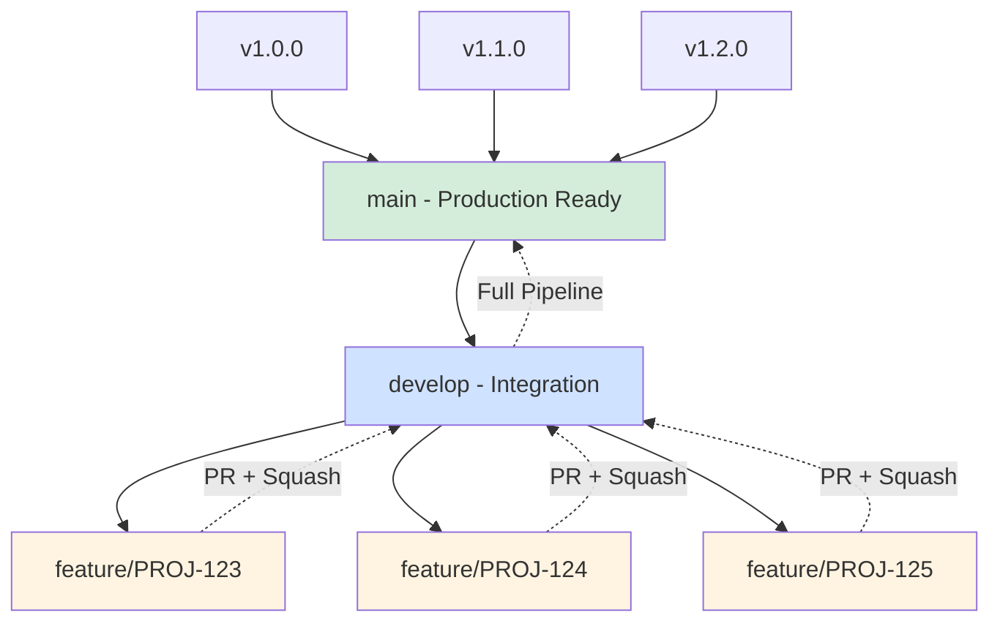

# Two Long Lived Branches Implementation

## Overview

This implementation uses two long-lived branches (`main` and `develop`) with feature branches for development work.

**Related Theory:**
- [Branching Strategies - Modified GitFlow](../theory.md#strategy-2-modified-gitflow)
- [Continuous Integration](../theory.md#continuous-integration-ci)
- [Continuous Delivery](../theory.md#continuous-delivery-cd)
- [Principles](../theory.md#principles)

## End-to-End Delivery Pipeline

## Workflow Steps

### 1. Create a Jira Ticket

Create a Jira ticket describing the required change.

### 2. Create Feature Branch

Create a feature branch off `main` with the name of the Jira ticket.

**Example:** `PROJ-123` - "Propose an improved delivery pipeline"

**Purpose:** This is needed for the pipeline to automatically link the branch to the Jira ticket.

### 3. Development on Feature Branch

Before pushing commits to origin, make sure:

- [ ] All the tests pass on your machine
- [ ] Commit message follows [Pull Request Message](#pull-request-message-requirements) requirements
  - If it doesn't, it will be reverted automatically by the pipeline
  - GitHub Pull Request merge option should be "Rebase and merge" (see [Squash on GitHub](#squash-on-github))

### 4. Create Pull Request

Once feature is completed, create a PR to merge `feature branch` into `develop`.

**Related Theory:**
- [Pull Request Review](../theory.md#pull-request)
- [Testing - Unit Tests](../theory.md#unit)

**Requirements:**

- [ ] The title must follow [Pull Request Title](#pull-request-title-requirements) requirements
  - If it doesn't, it will be reverted automatically by the pipeline to main head
- [ ] **Quick feedback pipeline** will run on each new commit added to the Pull Request source branch
- [ ] If PR is not created from feature branch into develop branch, the pipeline will fail with an error

### 5. Merge to Develop

Once the **Quick feedback pipeline** is green and PR is reviewed and approved:

**Merge Options:**

1. **Default:** Use "Squash and Merge" option (see [Squash on GitHub](#squash-on-github))
2. **Rare cases:** When there is a need to keep all commits from the feature branch, use "Rebase and merge" option (see [Squash on GitHub](#squash-on-github))

### 6. Full Feedback Pipeline

Once feature branch is merged into `develop`, the **Full feedback pipeline** will be triggered, which will:

**Related Theory:**
- [Release Candidate](../theory.md#release-candidate)
- [Deployment](../theory.md#deployment)
- [Versioning](../theory.md#versioning)
- [Environments](../theory.md#environments)

**Pipeline Actions:**

1. **Validate commit message** - Check if it follows standards
   - If not: Revert develop to main

2. **Generate Release Notes** - Automatically create release documentation

3. **Build release candidate**
   - If build fails: Revert develop to main

4. **Deploy artifact to dev environment**
   - If deployment fails: Revert to previous state (dev environment to latest release version, develop to main)

5. **Run all tests**
   - If any fail: Revert to previous state

6. **Promote release candidate** - Tag with next [Semantic Versioning](#semantic-versioning)

7. **Merge to main**

8. **Notify QAs** of the new available release

9. **Collect DORA metrics** - Based on [Semantic Versioning](#semantic-versioning) and durations to measure, assess, and improve delivery process

**Related Theory:**
- [Measure - DORA Metrics](../theory.md#measure)
- [Assess](../theory.md#assess)
- [Improve](../theory.md#improve)

### 7. On-Demand Deployment to Production

When a new version needs to be deployed to production using **On demand** deployment job:

**Related Theory:**
- [Release](../theory.md#release)
- [Deployment](../theory.md#deployment)
- [Environments](../theory.md#environments)

**Deployment Flow:**

1. **QA:** Deploys and tests on **QA** environment
2. **BA/PM:** Reviews and approves the tested version
3. **Create Release:** Release is created and deployed to **Stage** for final verification
4. **PO:** Reviews Stage and approves for production
5. **Deploy to Production:** Automated deployment to production environment

## Requirements Reference

**Related Theory:**
- [Commit Message](../theory.md#commit-message)
- [Versioning](../theory.md#versioning)

### Pull Request Message Requirements

- Follow Conventional Commits specification
- Include ticket reference
- Clear, descriptive message

### Pull Request Title Requirements

- Must include Jira ticket ID
- Follow naming convention
- Clear description of changes

### Semantic Versioning

Version format: `MAJOR.MINOR.PATCH`

- **MAJOR:** Incompatible API changes
- **MINOR:** Backwards-compatible functionality additions
- **PATCH:** Backwards-compatible bug fixes

### Squash on GitHub

**Squash and Merge:**
- Combines all commits from feature branch into a single commit
- Keeps main/develop history clean and linear
- Recommended for most feature branches

**Rebase and Merge:**
- Preserves all individual commits from feature branch
- Use only when commit history is important
- Maintains detailed development history

## Benefits

**Related Theory:**
- [Goal - Elite Pipeline](../theory.md#goal---more-cheaper-faster)
- [Principles](../theory.md#principles)
- [Objectives - Automate](../theory.md#automate)

- **Two stable branches:** `main` (production-ready) and `develop` (integration)
- **Automated validation:** Commit messages, builds, and tests
- **Release candidates:** Test before promoting to release
- **Automatic rollback:** Reverts on failure to maintain stability
- **DORA metrics collection:** Continuous improvement tracking
- **Role-based deployments:** Clear responsibilities for each environment

## Branch Strategy Summary

**Related Theory:** [Branching Strategies - Modified GitFlow](../theory.md#strategy-2-modified-gitflow)

---

*Implementation: Two Long Lived Branches (main + develop)*
