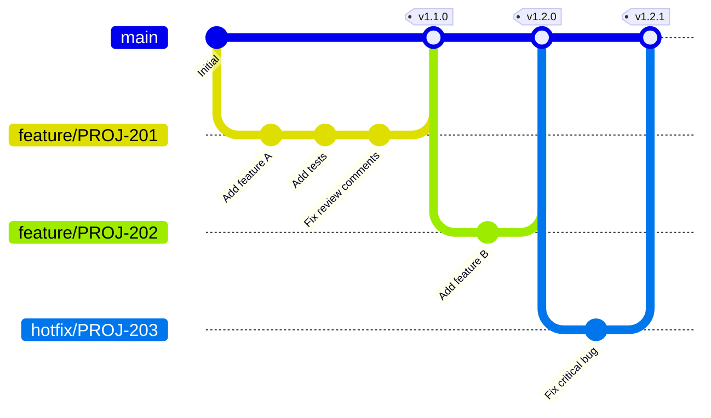
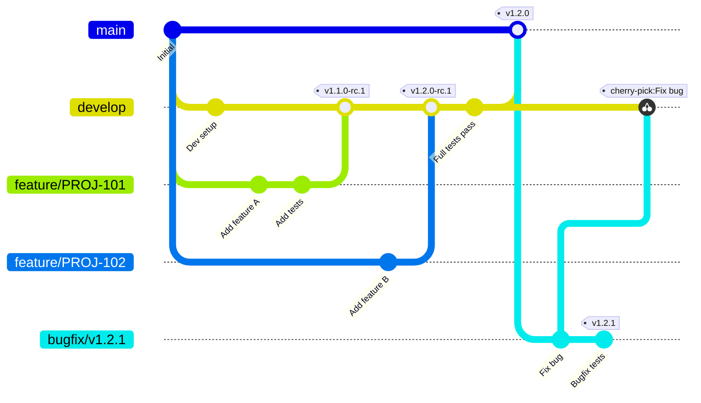
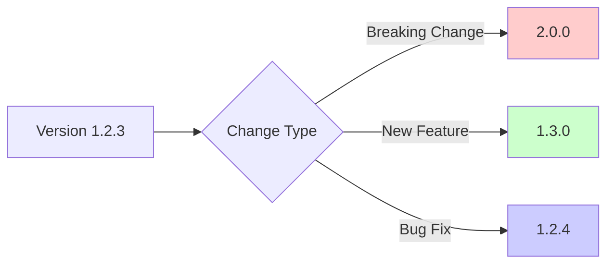
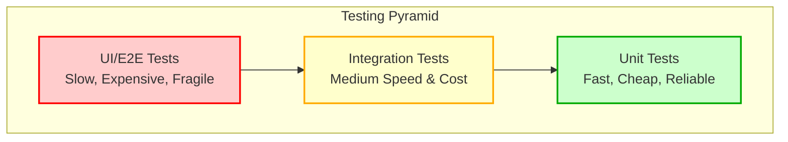
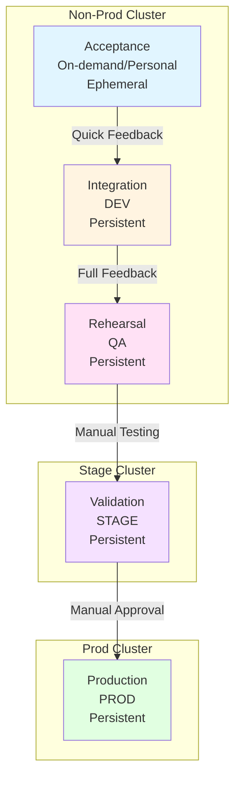
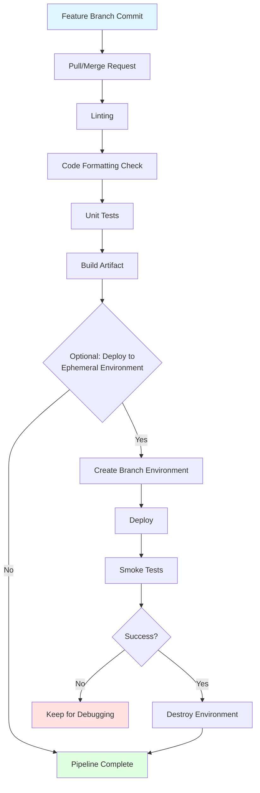
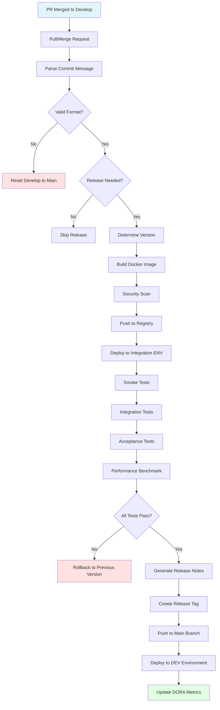
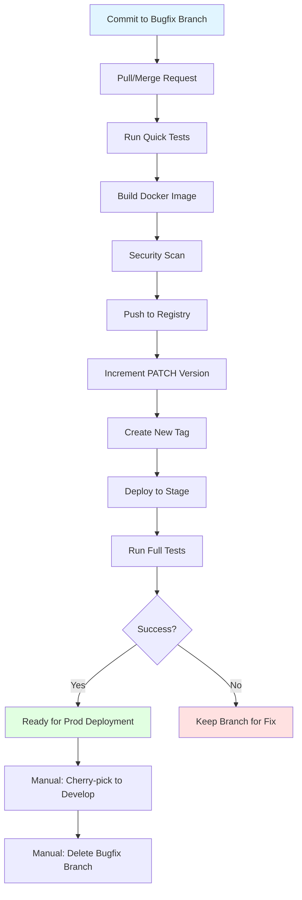
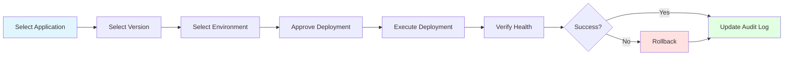

# 1. Theory

## Table of Contents
- [Goal - more, cheaper, faster](#goal---more-cheaper-faster)
- [Definition of terms](#definition-of-terms)
  - [Software delivery](#software-delivery)
  - [Release candidate](#release-candidate)
  - [Release](#release)
  - [Deployment](#deployment)
  - [Continuous Integration (CI)](#continuous-integration-ci)
  - [Continuous Delivery (CD)](#continuous-delivery-cd)
  - [Continuous Deployment (CD)](#continuous-deployment-cd)
  - [CI vs CD](#ci-vs-cd)
  - [Chosen approach](#chosen-approach)
- [Objectives](#objectives)
  - [Automate](#automate)
  - [Measure](#measure)
  - [Assess](#assess)
  - [Improve](#improve)
- [Principles](#principles)
- [Strategies](#strategies)
  - [Branching](#branching)
    - [Criteria](#criteria)
    - [Strategy 1: Trunk-Based Development (Simplified)](#strategy-1-trunk-based-development-simplified)
    - [Strategy 2: Modified GitFlow](#strategy-2-modified-gitflow)
    - [Which Strategy to Choose?](#which-strategy-to-choose)
  - [Versioning](#versioning)
  - [Commit Message](#commit-message)
    - [Why?](#why)
    - [What?](#what)
    - [How?](#how)
    - [When?](#when)
- [Testing](#testing)
  - [Quality](#quality)
    - [Linting](#linting)
    - [Formatting](#formatting)
    - [Pull Request](#pull-request)
  - [Functional](#functional)
    - [Unit](#unit)
    - [Smoke](#smoke)
    - [Integration](#integration)
    - [Acceptance](#acceptance)
    - [Exploratory](#exploratory)
  - [Data validation](#data-validation)
  - [Security](#security)
    - [Security test types](#security-test-types)
    - [Security attributes](#security-attributes)
    - [Security testing techniques](#security-testing-techniques)
      - [1. SAST (Static Application Security Testing)](#1-sast-static-application-security-testing)
      - [2. DAST (Dynamic Application Security Testing)](#2-dast-dynamic-application-security-testing)
      - [3. IAST (Interactive Application Security Testing)](#3-iast-interactive-application-security-testing)
      - [4. SCA (Software Composition Analysis)](#4-sca-software-composition-analysis)
      - [5. Fuzz Testing](#5-fuzz-testing)
    - [Security checklist](#security-checklist)
  - [Performance](#performance)
    - [System Capacity](#system-capacity)
    - [Benchmark](#benchmark)
    - [Stress Testing](#stress-testing)
    - [Spike Testing](#spike-testing)
    - [Load Testing](#load-testing)
    - [Endurance Testing](#endurance-testing)
    - [Volume Testing](#volume-testing)
    - [Scalability Testing](#scalability-testing)
- [Environments](#environments)
  - [Benefits of Multi-Environment Strategy](#benefits-of-multi-environment-strategy)
  - [Non-prod cluster](#non-prod-cluster)
    - [Acceptance (On-demand/personal)](#acceptance-on-demandpersonal)
    - [Integration environment](#integration-environment)
    - [Rehearsal (QA)](#rehearsal-qa)
  - [Stage cluster](#stage-cluster)
    - [Validation (Stage)](#validation-stage)
  - [Prod cluster](#prod-cluster)
    - [Prod](#prod)
- [Tools](#tools)
  - [Documentation](#documentation)
  - [Issue tracker](#issue-tracker)
  - [CI Server](#ci-server)
  - [Artefact repository](#artefact-repository)
  - [SCM](#scm)
  - [Logging](#logging)
  - [Metrics](#metrics)
  - [Monitoring & Alerting](#monitoring--alerting)
  - [Deployment Infrastructure](#deployment-infrastructure)
- [Pipelines](#pipelines)
  - [Release](#release)
    - [Quick feedback (PR) pipeline](#quick-feedback-pr-pipeline)
    - [Full feedback (Main) pipeline](#full-feedback-main-pipeline)
    - [Bugfix pipeline](#bugfix-pipeline)
  - [Deployment](#deployment-1)
    - [Automatic](#automatic)
    - [On demand](#on-demand)
- [Audit & Reporting](#audit--reporting)

## Goal - more, cheaper, faster

At the core, the software goal is increasing user productivity and satisfaction while reducing the production cost.

This boils down to several apparently conflicting requirements: **speed**, **quality** and **cost**.

Usually only two of these can be chosen at any given time:
1. if **speed** and **quality** is chosen, it will be costly;
2. if **speed** and **cost** is chosen, it will have lower quality;
3. if **quality** and **cost** is chosen, it will be slow;

Software delivery process needs to be defined & implemented in such a way that the goal of increased user productivity and satisfaction while reducing the production cost is met with all three conflicting requirements harmonised: speed, quality and cost.

In order to increase productivity and satisfaction while reducing the cost of software delivery we would need an **Elite Pipeline** meaning:
1. deployment to production on-demand (up to multiple times a day);
2. lead time for changes less than a day;
3. time to restore the service less than an hour;
4. change failure rate under 15%;

To achieve this goal we've set out some [Objectives](#objectives).

[↑ Back to top](#table-of-contents)

## Definition of terms

### Software delivery
Software delivery is the process of taking an idea and transforming it into workable software solution.

### Release candidate
A version of the software artefact that will undergo testing and validation on different test environments.

### Release
The release candidate version which was fully tested on different test environments and tagged with release version.

### Deployment
Installing a specific version (release or release candidate) onto an environment.

### Continuous Integration (CI)
Continuous Integration is a development methodology that involves frequent integration of code into a shared repository. The developer's changes are validated by creating a build and running automated tests against the build. By doing so, you avoid integration challenges that can happen when waiting for release day.

Continuous integration puts a great emphasis on testing automation to check that the application is not broken whenever new commits are integrated into the main branch.

### Continuous Delivery (CD)
Continuous delivery is a software engineering approach in which teams produce software releases (versions) in short cycles, ensuring that the software can be reliably deployed to any environment at any time. Key here is that it doesn't deploy the new releases to production automatically, but triggered manually.

### Continuous Deployment (CD)
Continuous Deployment goes one step further than continuous delivery. With this practice, every change that passes all stages of your production pipeline is released to your customers. There's no human intervention, and only a failed test will prevent a new change to be deployed to production.

### CI vs CD
To put it simply continuous integration is part of both continuous delivery and continuous deployment. And continuous deployment is like continuous delivery, except that deployment to production happens automatically.

For more info on the benefits of each practice see: [Continuous Integration vs Delivery vs Deployment](https://www.atlassian.com/continuous-delivery/principles/continuous-integration-vs-delivery-vs-deployment)

### Chosen approach
We would like to achieve **Continuous Deployment** but at the very least we should do **Continuous Delivery** with **Continuous Deployment to Dev environment**.

[↑ Back to top](#table-of-contents)

## Objectives

### Automate
Best way of achieving the stated goal would be to let the parties involved in the software delivery do what they are best at.

**Humans** are good at creative tasks and bad at repetitive manual processes which are tedious and error prone for them.

On the other hand **computers** are good at repetitive processes and bad at creative tasks.

So that the goal of increased productivity and satisfaction while reducing the cost can be achieved, humans need to be given the creative tasks and computers given the manual repetitive processes.

#### Examples of repetitive tasks:
1. **testing** - each time a change is made it need to ensure that previous functionality is not affected and new functionality is as expected, thus same set of tests need to be run with every change;
2. **deployment to environments** - different services deployment has to be done in different environments in the same way;
3. **release versioning** - each change need to be versioned and versions across microservices need to be aligned in case of breaking changes;
4. **release notes generation** - each release needs to have documented what changes it contains and a classification of what the change entails: new features, bug fixes or breaking changes.

#### Example of creative tasks:
1. **Exploratory testing**: when a QA randomly tests the look and feel of the newly released software version;
2. **Code review and approvals**;

> **Note:** AI is getting better and better at creative tasks as well. Modern AI tools can now assist with code reviews by identifying potential bugs, security vulnerabilities, code quality issues, and suggesting improvements. While human oversight remains important, AI-powered code review can significantly enhance the review process and catch issues that might be missed during manual review.

#### Automation benefits over manual execution:
1. **auditability** - every change is reviewed, every executed command is logged;
2. **consistency** - every time the same commands are executed in the same order, which eliminates the possibility of negligence errors;
3. **reproducibility** - given all parts of the pipeline are automated it is much easier to reproduce behaviour for a new pipeline or in a different environment;
4. **security** - a pipeline would only be able to execute the pre-defined commands;
5. **speed** - execution speed is way faster than manual;
6. **cost** - cost of automation becomes smaller with each repeating cycle;
7. **quality** - given higher execution speed at lower costs it allows spending more time and money on improving the quality;

### Measure
In order to qualify the performance of software delivery process we need some precise metrics executed consistently.

Through its six years of research, the **DevOps Research and Assessment (DORA)** team has identified four key metrics for software delivery team performance in relation to automation:

| Metric | Elite | High | Medium | Low |
|--------|-------|------|--------|-----|
| **Deployment Frequency** | On-demand (multiple deploys per day) | Between once per day and once per week | Between once per week and once per month | Between once per month and once every 6 months |
| **Lead Time for Changes** | Less than one day | Between one day and one week | Between one week and one month | Between one month and six months |
| **Time to Restore Service** | Less than one hour | Less than one day | Between one day and one week | More than six months |
| **Change Failure Rate** | 0-15% | 16-30% | 16-30% | 16-30% |

*Source: [Four Keys - Google Cloud Platform](https://github.com/GoogleCloudPlatform/fourkeys)*

The closer our performance indicator is to **ELITE** the fuller our goal is met.

There are certain tools, strategies, processes and practices that will help us achieve the goal of increased productivity by fulfilling our automation objectives.

### Assess
Organizations with infrequent releases, limited automation, and manual testing processes often face challenges. When releases occur infrequently (e.g., quarterly or less), large code differences accumulate, requiring extensive time for validation and manual testing.

Teams in this situation typically fall on the **low side** of the performance metrics, meaning their releases are expensive, their rate of change is slow, and they will likely experience a high change failure rate with extended time to restore services.

It's essential to implement the key DORA metrics and assess regularly where your organization stands with software delivery performance and in which direction you're moving. This process should be automated so that decisions are based on hard numbers rather than subjective feelings.

### Improve
The reason for the automation and measurement is to have a clear view of where we stand and what areas we can improve in order to achieve the goal of increasing the productivity while lowering the cost.

Hence we need to revisit the performance indicators regularly (at least once per quarter).

[↑ Back to top](#table-of-contents)

## Principles

1. **Minimize human factor** - humans are good with creative tasks, bad with repetitive tasks and can make mistakes in the process, we should automate every task that is executed more than once;

2. **Bring the pain forward** - if a task is difficult:
   - start doing it from the beginning, the earlier a problem is identified the cheaper is to fix;
   - perform it more often, don't leave it to the end where there won't be time to do it properly;

3. **DRY - Don't Repeat Yourself** - re-use tasks and code, repetition is causing maintenance, consistency and satisfaction issues;

4. **KISS - Keep It Stupid Simple** - a complicated delivery process with many manual steps is error prone, hard to understand, difficult to extend and not easy to love, keep it simple and automate everything that is repeated more than one time;

5. **Microservice not distributed monolith** - microservice is an individually deployable unit which owns its data exclusively. There should be no shared databases between different deployable units, there should be no requirement to deploy two microservices at the same time;

6. **Do not save time on tests** - it might be appealing to save some time by not writing tests, this is a bad practice for any code which is more than a script and catastrophic for any code which is supposed to survive more than a year of active development. No one needs a code to be afraid to touch due to unknown consequences, or a code which needs to be tested manually for weeks or months before it can be deployed;

7. **Enforcement over convention** - better to enforce agreements with restrictions built into a pipeline rather than having unenforced agreements in a document, humans can easily forget agreements and tend to take shortcuts under pressure;

8. **No test code in production** - In production should be minimal possible code to run the functionality (no test code, no test libraries, no unused libraries) as this is a security concern to minimize the attack vector;

9. **Always green code** - no broken code by an automated pipeline - there should be code in always working state;

10. **No possibility of diverging branches** - there should be only one long lived branch that is modified though a PR;

11. **Improve developer speed without affecting quality** - hence Quick feedback pipeline before building docker image, and Full feedback pipeline using docker image;

12. **Build once deploy multiple times** - there should be no artefacts rebuilt for each environment, there should be the same artefact version tested and promoted to different environments at different times by different people, otherwise there can be no guaranteed that the tested code is the same code deployed to production;

13. **Integration** - the tools and processes should be automatically integrated rather than manually aligned;

[↑ Back to top](#table-of-contents)

## Strategies

To support the goal, principles and pipelines we need to be engaging certain tools and strategies.

### Branching

We need a branching strategy which will ensure speed and quality of our deliveries.

#### Criteria

In order to achieve this there are several criteria for choosing the right branching strategy:
1. Developers need to be able to work in parallel without affecting each other;
2. There should be a quick feedback (max 10 minutes) to the developers on changes, waiting long time for feedback is counterproductive;
3. There should be a full feedback before releasing a new version;
4. No common branch freezing;
5. No one developer blocking others and having to fix problems under pressure;
6. Main branch should always be green, so at any time anyone can branch out with confidence that there are no problems;
7. Ensure linear, clean history with meaningful commits;

We present two branching strategies that meet these criteria. Choose the one that best fits your team's maturity and automation capabilities.

---

#### Strategy 1: Trunk-Based Development (Simplified)

This is the simplest and most modern approach, recommended for teams with mature CI/CD practices and comprehensive automated testing.

**Key characteristics:**
1. Only one long-lived branch: `main`;
2. Feature branches are created from `main` and merged back to `main` via Pull Requests;
3. All tests (unit, integration, acceptance, smoke) run on every PR before merge;
4. PRs must pass all tests and code review before being merged;
5. Once merged to `main`, the code is automatically deployed through the pipeline;
6. Bug fixes are created from `main`, tested via PR, and merged back to `main`;



##### Branches (Strategy 1)

**main branch:**
- The only long-lived branch;
- Always deployable and in a green state;
- All PRs merge here after passing full test suite;
- Every merge triggers automated deployment to production (or staging for manual approval);

**feature branches:**
- Short-lived branches for developing one feature;
- Named after issue tracker ticket: `feature/PROJ-123`;
- Branched from `main`;
- Full test suite runs on every commit/push;
- Merged via PR with squash and merge after all tests pass and code review approval;
- Automatically deleted after merge;

**hotfix branches:**
- Short-lived branches for urgent production fixes;
- Named after issue tracker ticket: `hotfix/PROJ-123`;
- Branched from `main`;
- Follow same PR process as feature branches;
- Merged back to `main` after tests pass;

##### Step by step guide (Strategy 1)

1. Create a feature branch from `main` with the issue tracker ticket id (eg: `feature/PROJ-123`);
2. Develop and commit your changes;
3. Keep your branch up to date with `main` by rebasing (DO NOT merge main into your branch);
4. Push to remote and create a Pull Request to `main`;
5. All automated tests run on the PR;
6. Address code review feedback;
7. Once all tests pass and PR is approved, use **Squash and merge** to merge into `main`;
8. The branch is automatically deleted;
9. Automated pipeline deploys to environments;

**Advantages:**
- Simplest workflow - one branch to rule them all;
- Fastest feedback loop;
- Forces comprehensive automated testing;
- Continuous deployment ready;
- No merge conflicts between long-lived branches;

**Requirements:**
- Comprehensive automated test suite;
- Fast test execution (under 10 minutes);
- Strong CI/CD pipeline;
- Team discipline and mature practices;
- Feature flags for incomplete features;

---

#### Strategy 2: Modified GitFlow

This strategy provides an additional safety layer with a `develop` branch for integration testing before production release. Recommended for teams transitioning to continuous delivery or with less comprehensive test coverage.

**Key characteristics:**
1. We only have two long running branches: `develop` & `main`;
2. New feature branches are only created from `main`;
3. PRs are only raised from feature branches into `develop`;
4. The only way into `main` branch is automated push by the Full Pipeline from `develop` branch;
5. No release branches as they are replaced by the release tags;
6. Bug Fix branches are:
   - created from tags;
   - creating new bug fix releases by bugfix pipeline;
   - deleted after release;
   - new bug fix is cherry-picked from new release tag into `develop` only (never into `main`);



##### Branches (Strategy 2)

##### Branches (Strategy 2)

##### main branch
- long lived stable branch containing latest released code;
- commits into this branch are the last step in the delivery pipeline after the code was fully tested on all levels;
- so this branch is always in a green state;

##### develop branch
- longed lived unstable branch used for triggering the Full feedback pipeline;
- often this branch contains not fully tested code which can be reverted anytime to main (in case of pipeline failures);

##### feature branches
- short term branch to develop one feature;
- it should be branched of the `main` branch;
- it should be named after issue tracker ticket, example: `PROJ-123`, reason for this is that the pipeline will be able to link the branch to the ticket, so that the change description can be linked with the implementation code;
- after the feature is completed and Quick feedback pipeline is green a PR merged into `develop` it will be deleted;

##### bugfix branch
- short lived branch for production version fixes;
- it should be created of the current production release version tag;
- each commit to this branch will trigger Bugfix pipeline and upon success will result in a new bug fix release version (see Versioning for details);
- this branch will NOT be merged into any branch nor it will be deleted automatically;
- changes from this branch will need to be manually applied (cherry picked or manually copied) to the `develop` branch, which will trigger develop Full feedback pipeline and upon success end up in `main` this way;
- after applying the changes to develop, success Full feedback pipeline and merge into main, this branch needs to be manually deleted;

##### Step by step guide (Strategy 2)

1. Create a feature branch with name of the id of the issue tracker ticket (eg: `PROJ-123`) from the `main` branch;
2. Once the feature is completed make sure your branch has all the commits from `main`, if it doesn't then do a rebase on top of `main`, **DO NOT merge main into your branch**;
3. Raise a Pull Request into `develop` branch;
4. Once you can merge your feature branch into develop make sure your select **Squash and merge** option on GitHub;

**Advantages:**
- Additional safety layer with `develop` branch for integration testing;
- Gradual transition to continuous delivery;
- Allows for release candidates and staging;
- Good for teams building test coverage;

**Trade-offs:**
- More complex than trunk-based development;
- Potential for merge conflicts between `develop` and `main`;
- Slower feedback loop;
- Requires maintaining two long-lived branches;

---

#### Which Strategy to Choose?

**Choose Strategy 1 (Trunk-Based Development) if:**
- You have comprehensive automated test coverage (>80%);
- Your test suite runs quickly (<10 minutes);
- Your team practices TDD or has strong testing discipline;
- You want to achieve continuous deployment;
- You're comfortable with feature flags for incomplete features;

**Choose Strategy 2 (Modified GitFlow) if:**
- You're building up your test automation;
- You need an integration testing phase before production;
- Your team is transitioning from traditional release cycles;
- You need explicit release candidates;
- You want an additional safety net before production;

**Recommendation:** Start with Strategy 2 if uncertain, then migrate to Strategy 1 as your automated testing matures and team confidence grows.

### Versioning

How strange it may seem, this is one of the topics that generate fierce debates, each time there is a new release people try to come up with a version, often based on feelings.

Then they get so attached emotionally that it becomes very sentimental like many examples from the [Sentimental Versioning](https://github.com/dominictarr/sentimental-versioning) web site.

We would like to take a more mathematical approach proposed by [Semantic Versioning](https://semver.org/):

Given a version number **MAJOR.MINOR.PATCH** (example: `1.2.3`) increment the:
1. **MAJOR** version when you make backward incompatible API changes, it will change version `1.2.3` to `2.0.0`;
2. **MINOR** version when you add functionality in a backwards compatible manner, it will change version `1.2.3` to `1.3.0`
3. **PATCH** version when you make backwards compatible bug fixes, it would change the version `1.2.3` to `1.2.4`



Base on these versions we can draw automatically some statistics that can inform our DORA metrics.

### Commit Message

#### Why?

We need such a commit message format so it can be automatically parsed by the pipeline to:
1. figure out if there needs to be a new release or not (in case there is no new deployable code, like typo fixes, tests added, etc.);
2. if there needs to be a new release, to derive the next semantic versioning;
3. to be able to generate release changelog;
4. to be able to generate releases;

On top of the above, we would like a commit message log which has meaningful commits with well formatted messages.

#### What?

In a nutshell there will be one GitHub squashed commit per pull request, which will have the message of the Pull Request Title containing one of 4 key words:

1. **fix** - meaning commit contains a bug fix and it will generate a new semantic version with the patch version changed;
2. **feat** - meaning commit contains a new feature and it will generate a new semantic version with the minor version changed;
3. **breaking change** - meaning commit contains a backward incompatible api changes and it will generate a new semantic version with the major version changed;
4. **anything else** - meaning there is no new release generated;

For more details and examples please read on.

#### How?

##### Conventional commits

Our commit messages will follow [Conventional Commits](https://www.conventionalcommits.org/) with [Angular Commit Message Conventions](https://github.com/angular/angular/blob/main/contributing-docs/commit-message-guidelines.md) rules adding issue tracker ticket id and pull request number.

Commit messages will be parsed and validated using Semantic Release libraries to generate Semantic Version and changelogs.

**NOTE:** if the commit message won't follow this format, develop branch will be reset to main and you will need to raise a Pull Request again with the correct format of the commit message/s.

Commit message should be in the following format:

```
<type>[optional scope]: <description> [<Issue ticket id>]

[optional body]

[optional footer(s)]
```

All types are listed on: [Angular Contributing Guide - Type](https://github.com/angular/angular/blob/main/contributing-docs/commit-message-guidelines.md#type)

All scopes are listed on: [Angular Contributing Guide - Scope](https://github.com/angular/angular/blob/main/contributing-docs/commit-message-guidelines.md#-scope)

##### Examples

###### bug fix

For Pull Request Title (when using option **Squash and merge** on GitHub):
```
fix: add incidents endpoint [PROJ-123] #65
```

For feature branch commits (when using option **Rebase and merge** on GitHub):
```
fix: add incidents endpoint [PROJ-123]
```

###### feature

For Pull Request Title (when using option **Squash and merge** on GitHub):
```
feat: add incidents endpoint [PROJ-123] #65
```

For feature branch commits (when using option **Rebase and merge** on GitHub):
```
feat: add incidents endpoint [PROJ-123]
```

###### breaking change

For Pull Request Title (when using option **Squash and merge** on GitHub):
```
feat: add incidents endpoint [PROJ-123] #65

BREAKING CHANGE: this breaks API compatibility.
```

##### Good commit message

For why and how to write a good commit message see [How to Write a Git Commit Message](https://chris.beams.io/posts/git-commit/)

Writing good commits rules can be summarized in the steps:
1. Separate subject from body with a blank line
2. Limit the subject line to 50 characters
3. Capitalize the subject line
4. Do not end the subject line with a period
5. Use the imperative mood in the subject line
6. Wrap the body at 72 characters
7. Use the body to explain what and why vs. how

#### When?

The advised option to merge a Pull Request from feature branch into develop is **Squash and merge**.

The new commit message which squashes the feature branch commits into one is taken from the Pull Request Title.

Please note that the suffix (for example: `#65`) with PR number will be added automatically when merging the PR, so that the final commit messaged on develop branch will be:

```
feat: add incidents endpoint (PROJ-123) #65
```

[↑ Back to top](#table-of-contents)

## Testing

Probably the most important component of the Software Delivery process is testing.

Testing is key to ensure quality of the delivered software, without testing sooner or latter the quality of the software will drop, its utility to the users will become insignificant and ultimately its adoption will be abandoned.

**The easiest way to kill a software's future is to not test it.**

Testing can be done:
- at many different levels: infrastructure, code, configuration, functionality, look and feel
- by different actors: humans or computers.

Given our Goal to deliver more, cheaper and faster, the first objective to achieve this goal is to **Automate** all repetitive tasks and do manually only creative tasks that can't be automated.

**Key is to find problems earlier in development process** as with each step towards production the cost of the fix increases and the impact of the problem becomes more visible.

Of all the different tests mentioned below only two should be manual: **Pull Request** and **Exploratory testing**. The vast majority of tests can and should be automated.

The goal of automated tests it to provide a **quick, consistent and accurate feedback** on the changes implemented.

### Quality

#### Linting

Lint, or a linter, is a static code analysis tool used to flag programming errors, bugs, stylistic errors and suspicious constructs.

#### Formatting

Code formatting provides you with many opportunities to subtly communicate your intent to a reader. Far from being a backwater best left to draconian "style guides", code formatting is often your reader's first encounter with your system. There are many tools to automatically format the code. The tools should be manually run to give the developer a chance to verify the formatting, the pipeline should check that the code is formatted properly and fail if it is not.

#### Pull Request

A pull request (sometimes called merge requests), is a review request. You are asking someone to check the changes on a branch before merging into another branch. It give developers a chance to review the changes and suggest any improvements or draw attention to any problems.

### Functional

The bulk of the tests should be functional tests which are forming so called **testing pyramid**:



#### Unit

Unit tests form the **base** of the testing pyramid. They test individual components or functionalities to validate that it works as expected in isolated conditions. It is important to run a number of scenarios in unit tests – happy path, error handling, etc.

Since this is the largest subset, the unit test suite must be written to run as quickly as possible. Keep in mind that the number of unit tests will increase as more features are added. This test suite needs to be run every time a new feature is added. Consequently, developers receive immediate feedback on whether individual features are working as they are meant to.

Needless to say, a fast-running unit test suite encourages devs to run it as often as possible. A good way to build a robust unit test suite is to practice **test-driven development (TDD)**. Since TDD requires a test to be written before any code, the code ends up being simpler, clearer and bug-free.

To understand how TDD works and its difference with BDD (Business-Driven Development) and ATDD, refer to [BDD vs TDD](https://www.browserstack.com/guide/tdd-vs-bdd-vs-atdd).

#### Smoke

Smoke testing checks the core functionality of a program, to ensure that the program is ready for further testing. This prevents a QA team from attempting to run a full test on software that can't complete basic functions.

These are quick tests which make sure the newly deployed service is configured correctly, can communicate with other services and is ready for other more comprehensive tests.

Smoke tests will be run each time on a newly deployed service to ensure the deployed version is working as expected, if this test fails, the service will be rolled back to the previous version (with the exception of the ephemeral environment to allow for troubleshooting).

#### Integration

Unit tests verify small pieces of a codebase. However, in order to test how this code interacts with other code (that form the entire software), integration tests need to be run. Essentially, these are tests that validate the interaction of a piece of code with external components. These components can range from databases, external services (APIs) and the like.

Integration tests are the second layer of the test automation pyramid. This means that it should not be run as frequently as unit tests. Fundamentally, they test how a feature communicates with external dependencies. Whether it is a call to a database or web service, the software needs to communicate effectively and retrieve the right information to function as expected.

Remember that since integration tests involve interaction with external services, they will run slower than unit tests. They also require an infrastructure environment in which to run.

#### Acceptance

These are sometimes named **End2End tests**.

At the top of the pyramid are the end-to-end tests. These ensure that the entire application is functioning as required. End-to-end tests do exactly what the name suggests: test that the application is working flawlessly from start to finish.

When running these tests, it is important to imagine the user's perspective. How would an actual user interact with the app? How can tests be written to replicate that interaction?

End-to-end tests are at the top of the testing pyramid because they usually take the longest to run. They can also be fragile since they have to test a large variety of user scenarios. Like integration tests, these tests may also require the app to communicate with external dependencies, thus adding to possible bottlenecks in completion.

#### Exploratory

Exploratory testing is an approach to software testing that is often described as simultaneous learning, test design, and execution. It focuses on discovery and relies on the guidance of the individual tester to uncover defects that are not easily covered in the scope of other tests. It is a **creative task** highly reliant on the expertise of the Quality Assurance engineer.

### Data validation

There are source data changes which can cause application failures.

These can be handled at the application code level or as a separate suite of tests which run once or day or so to warn us of any potential problems.

### Security

Security testing is a process intended to reveal flaws in the security mechanisms of an information system that protect data and maintain functionality as intended.

#### Security test types

**What Are The Types Of Security Testing?**

1. **Vulnerability Scanning**: Automated scanning of systems using software tools to identify known vulnerabilities, security weaknesses, and misconfigurations. These scans produce reports that help prioritize remediation efforts based on severity levels.

2. **Security Scanning**: Systematic examination of applications, networks, and systems to identify security weaknesses and potential entry points for attackers. This includes network scanning, port scanning, and application scanning to detect configuration issues and exposed services.

3. **Penetration Testing**: Simulated cyber attacks performed by security professionals to exploit vulnerabilities in a controlled manner. This hands-on approach helps identify security gaps that automated tools might miss and validates the effectiveness of security controls.

4. **Security Audit/Review**: Comprehensive inspection of application code, system configurations, and security policies to ensure compliance with security standards and best practices. This includes reviewing access controls, encryption implementations, and adherence to security guidelines.

5. **Ethical Hacking**: Authorized attempt to gain unauthorized access to systems, applications, or data by mimicking the techniques and methods of malicious hackers. Ethical hackers identify vulnerabilities before they can be exploited by real attackers.

6. **Risk Assessment**: Systematic process of identifying, analyzing, and evaluating security risks to determine their potential impact on the organization. This helps prioritize security investments and implement appropriate risk mitigation strategies.

7. **Posture Assessment**: Comprehensive evaluation of an organization's overall security posture, including policies, procedures, infrastructure, and controls. This assessment provides a holistic view of security strengths and weaknesses across the entire environment.

Many of the security tests can and should be automated.

*Source: [Attributes and Types of Security Testing](https://www.indusface.com/blog/attributes-and-types-of-security-testing/)*

#### Security attributes

**What Are The 7 Attributes That Security Testing Must Include?**

1. **Authentication**: Verification that users or systems are who they claim to be through credentials, tokens, biometrics, or multi-factor authentication. Testing ensures authentication mechanisms are robust and cannot be easily bypassed or compromised.

2. **Authorization**: Validation that authenticated users have appropriate permissions and access rights to perform specific actions or access particular resources. Testing verifies that privilege escalation is prevented and access controls are properly enforced.

3. **Confidentiality**: Assurance that sensitive data is protected from unauthorized access and disclosure through encryption, access controls, and secure transmission protocols. Testing confirms that data remains private and is only accessible to authorized parties.

4. **Availability**: Guarantee that systems, applications, and data are accessible and operational when needed by authorized users. Testing includes resilience against denial-of-service attacks and validates disaster recovery and business continuity capabilities.

5. **Integrity**: Assurance that data remains accurate, complete, and unmodified during storage, processing, and transmission unless authorized changes are made. Testing verifies data validation, checksums, digital signatures, and protection against unauthorized modifications.

6. **Non-Repudiation**: Proof that actions and transactions cannot be denied by the parties involved, typically achieved through digital signatures, audit trails, and logging mechanisms. Testing ensures accountability and provides evidence for dispute resolution.

7. **Resilience**: Ability of systems to withstand, recover from, and adapt to adverse conditions, attacks, or failures while maintaining essential functions. Testing validates failover mechanisms, redundancy, and the system's capability to continue operating under stress or attack.

*Source: [Attributes and Types of Security Testing](https://www.indusface.com/blog/attributes-and-types-of-security-testing/)*

#### Security testing techniques

Security testing techniques describe how the test is performed:

##### 1. SAST (Static Application Security Testing)

Automated analysis of source code, bytecode, or binary code for security vulnerabilities without executing the application. Detects security issues early in the SDLC and integrates into CI/CD pipelines. May produce false positives and requires access to source code.

##### 2. DAST (Dynamic Application Security Testing)

Black-box testing method that identifies vulnerabilities in a running application by simulating external attacks. Tests the application from the outside with realistic attack scenarios (SQL injection, XSS, CSRF). Requires a running environment and may miss logic flaws not visible via the UI.

##### 3. IAST (Interactive Application Security Testing)

Hybrid testing method that operates inside a running application, combining static and dynamic testing benefits. IAST agents monitor real-time code execution and user interactions, delivering high accuracy with minimal false positives. Fits seamlessly into agile development and CI/CD pipelines.

##### 4. SCA (Software Composition Analysis)

Identifies security risks in open-source and third-party components by analyzing dependencies, comparing against vulnerability databases, and detecting license compliance issues. Ensures that libraries and frameworks are secure and up-to-date.

##### 5. Fuzz Testing

Dynamic technique that bombards applications with malformed, unexpected, or random inputs to uncover vulnerabilities. Highly effective at discovering zero-day and deep logic flaws, especially useful for APIs, parsers, and protocol implementations.

#### Security checklist

**Security Testing Techniques:**

- [ ] Implement SAST (Static Application Security Testing)
  - Integrate static code analysis tools into CI/CD pipeline (e.g., SonarQube, Checkmarx, Fortify)
  - Scan source code for vulnerabilities early in the SDLC
  - Configure automated reports and severity thresholds

- [ ] Implement DAST (Dynamic Application Security Testing)
  - Set up automated security scanning against running applications
  - Test for SQL injection, XSS, CSRF, and other runtime vulnerabilities
  - Schedule regular scans in staging/test environments

- [ ] Implement SCA (Software Composition Analysis)
  - Scan dependencies for known vulnerabilities (e.g., Snyk, Dependabot, OWASP Dependency-Check)
  - Monitor open-source components and third-party libraries
  - Automate alerts for vulnerable or outdated dependencies

- [ ] Consider IAST (Interactive Application Security Testing)
  - Evaluate IAST tools for hybrid runtime analysis
  - Integrate with functional testing for real-time vulnerability detection

- [ ] Implement Fuzz Testing
  - Set up fuzzing for APIs, parsers, and protocol implementations
  - Automate continuous fuzzing to discover zero-day vulnerabilities

**Security Test Types:**

- [ ] Conduct regular Vulnerability Scanning
  - Automate scanning of systems and networks for known vulnerabilities

- [ ] Perform Penetration Testing
  - Schedule periodic penetration tests by security professionals
  - Test both internal and external attack vectors

- [ ] Conduct Security Audits
  - Review code, configurations, and security policies regularly
  - Ensure compliance with security standards and best practices

- [ ] Perform Risk Assessments
  - Identify and evaluate security risks across the organization
  - Prioritize remediation based on risk impact

**Security Attributes Implementation:**

- [ ] Authentication
  - Implement strong authentication mechanisms (multi-factor authentication)
  - Test authentication bypass scenarios
  - Enforce secure credential storage and transmission

- [ ] Authorization
  - Implement role-based access control (RBAC)
  - Test for privilege escalation vulnerabilities
  - Prevent user prod modifications without proper elevation
  - Users must be elevated temporarily by administrators to alter kubernetes resources (except CI/CD robot accounts)

- [ ] Confidentiality
  - Enable SSL/TLS communication between all services and databases
  - Implement mutual authentication for internal services
  - Encrypt sensitive data at rest and in transit
  - Perform regular SSL certificate rotation

- [ ] Availability
  - Implement Web Application Firewall (WAF) to prevent exploitation attacks
  - Test resilience against denial-of-service attacks
  - Implement 24/7 monitoring and alerting

- [ ] Integrity
  - Implement data validation and checksums
  - Monitor data changes and maintain audit logs
  - Perform regular data analysis and housekeep/archive/discard data regularly

- [ ] Non-Repudiation
  - Implement comprehensive audit trails and logging
  - Ensure all actions are traceable to specific users/accounts

- [ ] Resilience
  - Test failover mechanisms and redundancy
  - Validate disaster recovery capabilities

**Container & Infrastructure Security:**

- [ ] Implement container security scanning before pushing to registry
  - On AWS ECR, this option is built-in
  - For JFrog Artifactory, verify security scanning is enabled

- [ ] Enable running all containers as non-root users
  - Implement as Kubernetes cluster policy to prevent accidental root usage
  - Even executing commands within containers should require permission elevation in production

- [ ] Regularly rebuild container images
  - Rebuild with latest patched base images even without code changes
  - Rotate pods/containers regularly as a security practice

**User & Access Management:**

- [ ] Implement user management policies
  - Monitor for stale users and clean them up
  - Deactivate user accounts if inactive for a certain period
  - Implement user reactivation mechanism
  - Force regular user password rotation
  - Implement multi-factor user authentication

- [ ] Implement secrets management
  - Rotate database passwords regularly
  - Delegate secret management through tools like HashiCorp Vault
  - Avoid hardcoding credentials in code or configuration files

### Performance

In software quality assurance, performance testing is in general a testing practice performed to determine how a system performs in terms of **responsiveness** and **stability** under a particular workload.

Performance testing is critical to ensuring the stability, scalability and reliability of your applications that your customers expect. Developing a comprehensive performance test strategy involves selecting and executing the types of performance testing that are most relevant to your applications.

Performance testing is not "one size fits all", it is a complex and multi-faceted test discipline; however, with an understanding of the major types of performance testing, you can develop a effective performance test approach.

#### System Capacity

Performance is best assessed in terms of system capacity testing which is more of an overall assessment of the system performance in terms of:
- **throughput**: number of requests a second a system can serve;
- **performance**: maximum acceptable time for a request response time;
- **error rate**: maximum number of errors in terms of percentage from the total number of requests served;

Usually these metrics are the ones to be looked for in all types of performance testing mentioned below.

#### Benchmark

Most of the other types of performance testing are long running tests that cannot be run on every single commit or even on each version release.

Benchmark testing is a quick performance test (up to several minutes) that can be run on every version release and compare to previous version releases to make sure there is no sudden drop in performance.

#### Stress Testing

This test pushes an application beyond normal load conditions to determine which components fail first. Stress testing attempts to find the breaking point of the application and is used to evaluate the robustness of the application's data processing capabilities and response to high volumes of traffic.

#### Spike Testing

This testing evaluates the ability of the application to handle sudden volume increases. It is done by suddenly increasing the load generated by a very large number of users. The goal is to determine whether performance will suffer, the system will fail, or it will be able to handle dramatic changes in load.

This testing is critical for applications that experience large increases in number of users, for example, utility customers reporting power outages during storms. This can be considered a component of stress testing.

#### Load Testing

The purpose of load testing is to evaluate the application's performance under increasingly high numbers of users. Load, or increasing numbers of users are applied to the application under test and the results are measured to validate the requirements are met. This load can be the expected concurrent number of users on the application performing a specific number of transactions within the set duration. This test will give out the response times of all the important business critical transactions. If the database, application server, etc. are also monitored, then this simple test can itself point towards bottlenecks in the application software.

#### Endurance Testing

Endurance testing evaluates the performance of the system under load over time. It is executed by applying varying loads to the application under test for an extended period of time to validate that the performance requirements related to production loads and durations of those loads are met. Endurance testing can be considered a component of load testing and is also known as **soak testing**.

#### Volume Testing

Also known as **flood testing**, this testing is used to evaluate the application's ability to handle large volumes of data. The impact on response time and the behaviour of the application are analysed. This testing can be used to identify bottlenecks and to determine the capacity of the system. This type of performance testing is important for applications that deal with big data.

#### Scalability Testing

This testing is used to determine your application's ability to handle increasing amounts of load and processing. It involves measuring attributes including response time, throughput, hits and requests per second, transaction processing speed, CPU usage, Network usage and more. Results of this testing can be used in the planning and design phases of development which reduces costs and mitigates the potential for performance issues.

*Source: [Demystifying Six Major Types of Performance Testing](https://www.qualitestgroup.com/demystifying-six-major-types-performance-testing/)*

[↑ Back to top](#table-of-contents)

## Environments

> **Note:** The environment setup below represents the most comprehensive configuration, providing multiple layers of testing and validation. This can be adjusted based on your organization's needs:
> - **For teams with mature automated testing and no formal manual validation requirements**, you can simplify to fewer environments (e.g., just Integration → Production)
> - **Manual gates** (Manual Testing, Manual Approval) can be removed in favor of automated promotion if you have sufficient confidence in your automated test coverage and are pursuing continuous deployment
> - **Start simple** and add environments as needed rather than implementing all at once



### Benefits of Multi-Environment Strategy

Implementing a comprehensive multi-environment strategy provides significant advantages across multiple dimensions:

1. **Improve delivery speed** (as all activities below can go in parallel):
   - Developers can have changes automatically deployed to branch environments, available to be tested in isolation from other changes;
   - The pipeline has dedicated TEST environments to run automated tests;
   - Preview environments available for those who want to see the latest features;
   - QA teams have dedicated environments where they can deploy any needed feature in isolation, not depending on operations, product owners, or developers;
   - Product owners have stage environments to vet changes before approving production deployment;
   - Anyone who needs an extra environment can create on-demand environments at the push of a button.

2. **Improve delivery experience**:
   - No more waiting on external teams to deploy changes - stakeholders can pick a version and deploy to an environment they control exclusively;
   - No more pressure to complete testing as others are waiting on the environment;
   - No more blocking/freezing of common environments - different parts are tested in isolation;

3. **Improve production stability**:
   - No more production environment downtime because of testing running in production;
   - Less pressure on the production cluster;
   - Fewer changes on production cluster;

4. **Reduce the costs**:
   - Fewer persistent test environments needed as teams control their own environments and can deploy any version;
   - On-demand environments can be created/destroyed at the push of a button when additional environments are needed;
   - Proper isolation of environments to the delivery process participant groups, meaning less time wasted waiting on shared environments, redeployments, or fixing environments.

### Non-prod cluster

#### Acceptance (On-demand/personal)

These will be **ephemeral environments** created on demand and destroyed after their utility cease to exist.

Quick feedback pipeline will create an on-demand environment with the branch name, will deploy the artefact automatically, run smoke tests and destroy it.

In case of failure, the branch environment will not be rolled in case of failures to allow for troubleshooting.

Individual actors (Devs, QAs, etc.) can create an on-demand environment to test a particular version or functionality, then destroy it.

There will be a scheduled job running every night to destroy on-demand environment not marked as do-not-destroy.

#### Integration environment

Integration environment. This is a **dev cluster persistent environment** to which all new release candidates will be deployed automatically and Full feedback pipeline will be run on.

In case of failures, this environment will be reverted automatically to latest release version in order to not block the next release.

#### Rehearsal (QA)

**QA team controlled environment** to which QA team manually deploys the selected versions to be tested.

This is not a formal validation environment, it is just for QA testing to confirm required functionality is met, Bugs discovered in this environment do not need to formally be reported.

### Stage cluster

Organizations often need to decide whether to place a production-like environment (Stage) in the production cluster, non-production cluster, or a separate dedicated cluster.

The recommended approach is to create a **separate cluster** for the stage environment to ensure:
- Production environment safety and isolation
- Production-like controls and approvals without risking actual production
- Ability to run performance and load testing without impacting production

#### Validation (Stage)

**PO controlled environment**. This is an environment identical to production to which releases selected for production deployment will be manually deployed.

Selected releases will be either ordinary releases produced by the Full feedback pipeline or bug fixing releases produced by the Bugfix pipeline.

This is a **formal validation environment**, failure of deployment or test discovered bugs will require formal submit of bug reports of deployment failures.

This is the environment where **load testing** will occur.

### Prod cluster

#### Prod

This is the **production environment** exposed to the end users.

[↑ Back to top](#table-of-contents)

## Tools

### Documentation

We need a tool document our technical and business decisions as well as our delivery plans.

Common tools include **Confluence**, **Teams Wiki**, **Notion**, **GitHub Wiki**, or project readme files.

### Issue tracker

We need a tool to document and track the implementation of software deliveries.

Popular options include **Jira**, **Azure DevOps Boards**, **GitHub Issues**, **GitLab Issues**, or **Linear**.

We need to integrate this tool with our SCM repository so that each commit, pull request and release is linked to the ticket describing the change.

### CI Server

We need a tool which can orchestrate our pipelines and allow integration between all other tools described in this section.

Common CI servers include:
- **GitHub Actions**
- **GitLab CI/CD**
- **Microsoft Azure DevOps**
- **Jenkins**
- **CircleCI**
- **Travis CI**

### Artefact repository

We need a tool where to store our new released software.

Options include:
- **JFrog Artifactory**
- **Docker Hub**
- **Amazon ECR (Elastic Container Registry)**
- **Azure Container Registry**
- **Google Container Registry**
- **GitHub Container Registry**

### SCM

We need a tool to keep track of code changes.

**Git** is the tool of choice with git hosting platforms such as:
- **GitHub**
- **GitLab**
- **Bitbucket**
- **Azure DevOps Git**

### Logging

We need a tool where logs for the delivery and operation of the services can be easily viewed, searched and analysed.

Popular logging solutions include:
- **Splunk**
- **ELK Stack (Elasticsearch, Logstash, Kibana)**
- **Datadog**
- **New Relic**
- **CloudWatch (AWS)**
- **Azure Monitor**

### Metrics

We need a tool where performance and other software services operational aspects can be assessed.

Common metrics and monitoring tools:
- **Grafana**
- **Prometheus**
- **Datadog**
- **New Relic**
- **Azure Application Insights**
- **CloudWatch**

### Monitoring & Alerting

We need a tool to be able to monitor our running applications and alert in case of problems so that we can quickly address them.

Most logging and metrics platforms have built-in alerting capabilities. Dedicated alerting tools include:
- **PagerDuty**
- **Opsgenie**
- **VictorOps**

### Deployment Infrastructure

We need capability to group and deploy our services in isolated environments onto the same cluster.

Common approaches:
- **Kubernetes** with namespaces for environment isolation
- **Rancher** (Kubernetes management platform)
- **OpenShift**
- **Helm** for package management and deployments
- **Infrastructure as Code** tools like Terraform, Pulumi, or CloudFormation

[↑ Back to top](#table-of-contents)

## Pipelines

The software delivery process consists of two parts:
1. **Releasing the software** - creating new versions of deployable software artefacts;
2. **Deploying the software** - installing specific versions other deployable artefacts onto software infrastructure to be available for usage;

### Release

There are several competing needs when it comes to software releases:
1. Developers need quick feedback on how their changes affect the existing code base;
2. Stakeholders need full confidence that the changes fulfil the requirements without affecting previous functionality;

Hence there is a need for two release pipelines to meet these two needs.

#### Quick feedback (PR) pipeline

The goal of this pipeline is to give developers **quick feedback** on the impact of the changes made and identify most of the problems early where is cheaper to fix and there is less impact.

It should run on every single commit to feature branches and take **no longer than 10 minutes** to run.



**Key characteristics:**
- At this point we want to deploy a newly created throw away artefact to a newly created ephemeral environment to exclude problems created by the previous state of a persistent environment.
- We would only be interested here in configuration problems and that interfaces with other services are not broken.
- Also in case of errors, this environment will not be deleted, but left for investigation since this is an isolated environment and can be worked on without blocking delivery of the other features.
- It will only be deleted on successful completion of the pipeline.

**Note:** if ephemeral environment creation, deployment and deletion takes too long time, this can be excluded from the pipeline.

#### Full feedback (Main) pipeline

The goal of this pipeline is to give confidence to the stakeholders that the changes do not affect microservice communications, do not introduce regression bugs, implement the new requirements, doesn't affect performance of the application.

This is a **longer feedback pipeline**, can take up an hour to run.



**Key characteristics:**
- At this point we would like to deploy the release candidate to a persistent environment to catch the errors caused by a previous state of a persistent environment.
- In case of failure this environment will be rollbacked to the previous working state as it is a shared environment and we want to avoid blocking delivery of other feature while fixing problems.

#### Bugfix pipeline

Goal of this pipeline is to provide the capability to fix bugs on the production deployed version which is often versions behind the latest release (which is on main branch).



**Key characteristics:**
- Bugfix pipeline will deploy the production bug fix version to stage environment
- This branch will NOT be merged into any branch nor it will be deleted automatically
- Changes from this branch will need to be manually applied (cherry picked or manually copied) to the develop branch
- After applying the changes to develop, success Full feedback pipeline and merge into main, this branch needs to be manually deleted

### Deployment

#### Automatic

Automatic deployment will only be done by the pipelines:
- **Full feedback pipeline** will deploy release candidates to Test environment at the beginning and release to Dev environment at the end;
- **Bugfix pipeline** will deploy the production bug fix version to stage environment;

#### On demand

There should be only one deploy job to select:
- application from a drop down list
- a release version
- a target environment from a drop down list



[↑ Back to top](#table-of-contents)

## Audit & Reporting

We need visibility and confidence in our end to end delivery process, this would entail documenting:

1. **What changes new release version contains**: this will be done by automatically assigning a new semantic [Versioning](#versioning) and release notes generation base on the [Commit message](#commit-message);

2. **When, how and by whom the new release was tested** - this be done by automatically generating Testing reports;

3. **When, how and by whom the new release was deployed** - this will be done automatically by the [On demand](#on-demand) deployment job;

4. **Performance of our delivery process** - this will be done automatically by the DORA [Measure](#measure) process;

5. **When, how and by whom security scans were performed** - this will be done automatically by generating security reports from static and dynamic analysis tools integrated in the pipeline;

```mermaid
flowchart TD
    A[Software Delivery Process] --> B[Release Tracking]
    A --> C[Test Tracking]
    A --> D[Deployment Tracking]
    A --> E[Performance Tracking]
    A --> F[Security Tracking]
    
    B --> B1[Semantic Versioning]
    B --> B2[Release Notes]
    B --> B3[Changelog Generation]
    
    C --> C1[Test Execution Reports]
    C --> C2[Test Coverage]
    C --> C3[Test Results History]
    
    D --> D1[Deployment Logs]
    D --> D2[Who Deployed]
    D --> D3[When Deployed]
    D --> D4[Environment]
    
    E --> E1[DORA Metrics]
    E --> E2[Deployment Frequency]
    E --> E3[Lead Time]
    E --> E4[MTTR]
    E --> E5[Change Failure Rate]
    
    F --> F1[SAST Results]
    F --> F2[DAST Results]
    F --> F3[Vulnerability Reports]
    F --> F4[Security Scan History]
    
    style A fill:#e1f5ff
    style B fill:#fff4e1
    style C fill:#ffe1f5
    style D fill:#f5e1ff
    style E fill:#e1ffe1
    style F fill:#ffe1e1
```



[↑ Back to top](#table-of-contents)

---

*Document created: February 2, 2026*
